### Analysis Tasks to be performed:
1. Build a model of housing prices to predict median house values in California using the provided dataset.
2. Train the model to learn from the data to predict the median housing price in any district, given all the other metrics.
3. Predict housing prices based on median_income and plot the regression chart for it.


```python
#Import Necessary Libraries:
import pandas as pd
import numpy as np

from sklearn.preprocessing import LabelEncoder,StandardScaler
from sklearn.linear_model import LinearRegression,Ridge,Lasso,ElasticNet
from sklearn.tree import DecisionTreeRegressor
import statsmodels.formula.api as smf

from sklearn.metrics import mean_squared_error,r2_score
from math import sqrt

import seaborn as sns
import matplotlib.pyplot as plt
%matplotlib inline

import warnings
warnings.filterwarnings('ignore')

from matplotlib.axes._axes import _log as matplotlib_axes_logger
matplotlib_axes_logger.setLevel('ERROR')
```

# 1. Load Data
1. Read the “housing.csv” file from the folder into the program.
2. Print first few rows of this data.


```python
df_house=pd.read_excel("Dataset/1553768847_housing.xlsx")
```


```python
df_house.head()
```


<div>
<style scoped>
    .dataframe tbody tr th:only-of-type {
        vertical-align: middle;
    }

    .dataframe tbody tr th {
        vertical-align: top;
    }

    .dataframe thead th {
        text-align: right;
    }
</style>
<table border="1" class="dataframe">
  <thead>
    <tr style="text-align: right;">
      <th></th>
      <th>longitude</th>
      <th>latitude</th>
      <th>housing_median_age</th>
      <th>total_rooms</th>
      <th>total_bedrooms</th>
      <th>population</th>
      <th>households</th>
      <th>median_income</th>
      <th>ocean_proximity</th>
      <th>median_house_value</th>
    </tr>
  </thead>
  <tbody>
    <tr>
      <th>0</th>
      <td>-122.23</td>
      <td>37.88</td>
      <td>41</td>
      <td>880</td>
      <td>129.0</td>
      <td>322</td>
      <td>126</td>
      <td>8.3252</td>
      <td>NEAR BAY</td>
      <td>452600</td>
    </tr>
    <tr>
      <th>1</th>
      <td>-122.22</td>
      <td>37.86</td>
      <td>21</td>
      <td>7099</td>
      <td>1106.0</td>
      <td>2401</td>
      <td>1138</td>
      <td>8.3014</td>
      <td>NEAR BAY</td>
      <td>358500</td>
    </tr>
    <tr>
      <th>2</th>
      <td>-122.24</td>
      <td>37.85</td>
      <td>52</td>
      <td>1467</td>
      <td>190.0</td>
      <td>496</td>
      <td>177</td>
      <td>7.2574</td>
      <td>NEAR BAY</td>
      <td>352100</td>
    </tr>
    <tr>
      <th>3</th>
      <td>-122.25</td>
      <td>37.85</td>
      <td>52</td>
      <td>1274</td>
      <td>235.0</td>
      <td>558</td>
      <td>219</td>
      <td>5.6431</td>
      <td>NEAR BAY</td>
      <td>341300</td>
    </tr>
    <tr>
      <th>4</th>
      <td>-122.25</td>
      <td>37.85</td>
      <td>52</td>
      <td>1627</td>
      <td>280.0</td>
      <td>565</td>
      <td>259</td>
      <td>3.8462</td>
      <td>NEAR BAY</td>
      <td>342200</td>
    </tr>
  </tbody>
</table>
</div>


```python
import math
print(math.log(452600))
```

    13.022764012181574
    


```python
df_house.columns
```


    Index(['longitude', 'latitude', 'housing_median_age', 'total_rooms',
           'total_bedrooms', 'population', 'households', 'median_income',
           'ocean_proximity', 'median_house_value'],
          dtype='object')


# 2. Handle missing values :
Fill the missing values with the mean of the respective column.


```python
df_house.isnull().sum()
```


    longitude               0
    latitude                0
    housing_median_age      0
    total_rooms             0
    total_bedrooms        207
    population              0
    households              0
    median_income           0
    ocean_proximity         0
    median_house_value      0
    dtype: int64


We see that there are 207 null values in Column total_bedrooms. We replace the null values with the mean and check for nulls again.


```python
df_house.total_bedrooms=df_house.total_bedrooms.fillna(df_house.total_bedrooms.mean())
df_house.isnull().sum()
```


    longitude             0
    latitude              0
    housing_median_age    0
    total_rooms           0
    total_bedrooms        0
    population            0
    households            0
    median_income         0
    ocean_proximity       0
    median_house_value    0
    dtype: int64


# 3. Encode categorical data :
Convert categorical column in the dataset to numerical data.


```python
le = LabelEncoder()
df_house['ocean_proximity']=le.fit_transform(df_house['ocean_proximity'])
```

# 4. Standardize data :
Standardize training and test datasets.


```python
# Get column names first
names = df_house.columns
# Create the Scaler object
scaler = StandardScaler()
# Fit your data on the scaler object
scaled_df = scaler.fit_transform(df_house)
scaled_df = pd.DataFrame(scaled_df, columns=names)
scaled_df.head()
```


<div>
<style scoped>
    .dataframe tbody tr th:only-of-type {
        vertical-align: middle;
    }

    .dataframe tbody tr th {
        vertical-align: top;
    }

    .dataframe thead th {
        text-align: right;
    }
</style>
<table border="1" class="dataframe">
  <thead>
    <tr style="text-align: right;">
      <th></th>
      <th>longitude</th>
      <th>latitude</th>
      <th>housing_median_age</th>
      <th>total_rooms</th>
      <th>total_bedrooms</th>
      <th>population</th>
      <th>households</th>
      <th>median_income</th>
      <th>ocean_proximity</th>
      <th>median_house_value</th>
    </tr>
  </thead>
  <tbody>
    <tr>
      <th>0</th>
      <td>-1.327835</td>
      <td>1.052548</td>
      <td>0.982143</td>
      <td>-0.804819</td>
      <td>-0.975228</td>
      <td>-0.974429</td>
      <td>-0.977033</td>
      <td>2.344766</td>
      <td>1.291089</td>
      <td>2.129631</td>
    </tr>
    <tr>
      <th>1</th>
      <td>-1.322844</td>
      <td>1.043185</td>
      <td>-0.607019</td>
      <td>2.045890</td>
      <td>1.355088</td>
      <td>0.861439</td>
      <td>1.669961</td>
      <td>2.332238</td>
      <td>1.291089</td>
      <td>1.314156</td>
    </tr>
    <tr>
      <th>2</th>
      <td>-1.332827</td>
      <td>1.038503</td>
      <td>1.856182</td>
      <td>-0.535746</td>
      <td>-0.829732</td>
      <td>-0.820777</td>
      <td>-0.843637</td>
      <td>1.782699</td>
      <td>1.291089</td>
      <td>1.258693</td>
    </tr>
    <tr>
      <th>3</th>
      <td>-1.337818</td>
      <td>1.038503</td>
      <td>1.856182</td>
      <td>-0.624215</td>
      <td>-0.722399</td>
      <td>-0.766028</td>
      <td>-0.733781</td>
      <td>0.932968</td>
      <td>1.291089</td>
      <td>1.165100</td>
    </tr>
    <tr>
      <th>4</th>
      <td>-1.337818</td>
      <td>1.038503</td>
      <td>1.856182</td>
      <td>-0.462404</td>
      <td>-0.615066</td>
      <td>-0.759847</td>
      <td>-0.629157</td>
      <td>-0.012881</td>
      <td>1.291089</td>
      <td>1.172900</td>
    </tr>
  </tbody>
</table>
</div>


# 5. visualize relationship between features and target
Check for Linearity


```python
#plot graphs
fig,axs=plt.subplots(1,3,sharey=True)
scaled_df.plot(kind='scatter',x='longitude',y='median_house_value',ax=axs[0],figsize=(16,8))
scaled_df.plot(kind='scatter',x='latitude',y='median_house_value',ax=axs[1],figsize=(16,8))
scaled_df.plot(kind='scatter',x='housing_median_age',y='median_house_value',ax=axs[2],figsize=(16,8))

#plot graphs
fig,axs=plt.subplots(1,3,sharey=True)
scaled_df.plot(kind='scatter',x='total_rooms',y='median_house_value',ax=axs[0],figsize=(16,8))
scaled_df.plot(kind='scatter',x='total_bedrooms',y='median_house_value',ax=axs[1],figsize=(16,8))
scaled_df.plot(kind='scatter',x='population',y='median_house_value',ax=axs[2],figsize=(16,8))

#plot graphs
fig,axs=plt.subplots(1,3,sharey=True)
scaled_df.plot(kind='scatter',x='households',y='median_house_value',ax=axs[0],figsize=(16,8))
scaled_df.plot(kind='scatter',x='median_income',y='median_house_value',ax=axs[1],figsize=(16,8))
scaled_df.plot(kind='scatter',x='ocean_proximity',y='median_house_value',ax=axs[2],figsize=(16,8))
```


    <matplotlib.axes._subplots.AxesSubplot at 0x288205cf588>


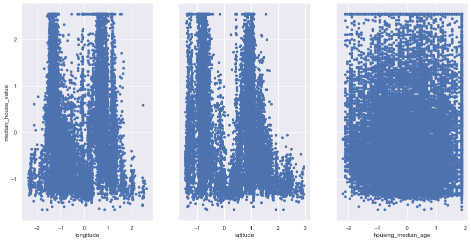


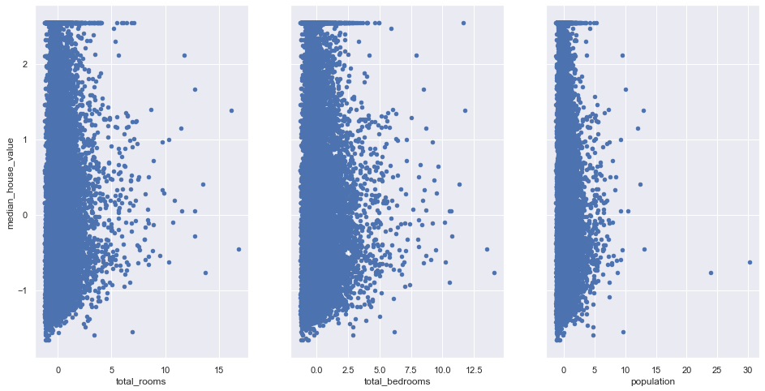


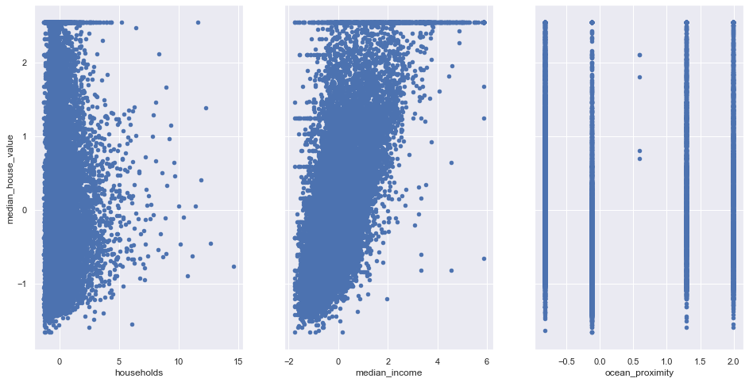


### Insight:
    The above graphs shows that only median_income and median_house_value has a linear relationship.

Check for Outliers:


```python
for column in scaled_df:
    plt.figure()
    sns.boxplot(x=scaled_df[column])
```


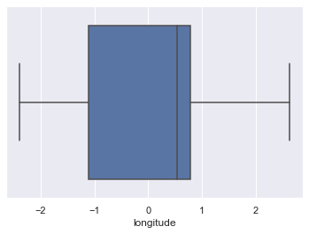


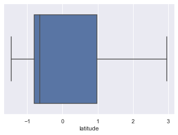


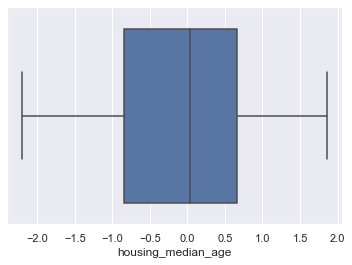


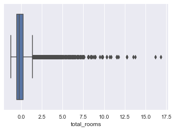


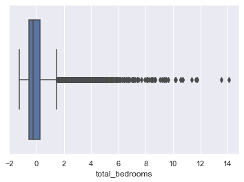


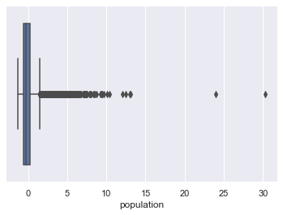


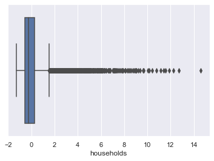


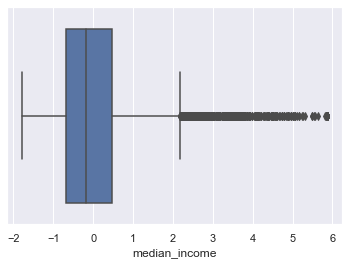


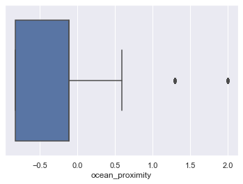


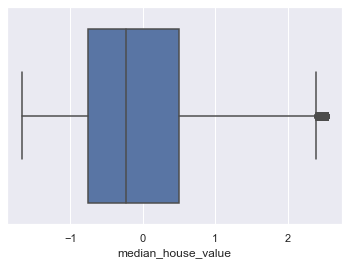


# 6. Extract X and Y data : 
Extract input (X) and output (Y) data from the dataset.


```python
X_Features=['longitude', 'latitude', 'housing_median_age', 'total_rooms',
       'total_bedrooms', 'population', 'households', 'median_income',
       'ocean_proximity']
X=scaled_df[X_Features]
Y=scaled_df['median_house_value']

print(type(X))
print(type(Y))
```

    <class 'pandas.core.frame.DataFrame'>
    <class 'pandas.core.series.Series'>
    


```python
print(df_house.shape)
print(X.shape)
print(Y.shape)
```

    (20640, 10)
    (20640, 9)
    (20640,)
    

# 7. Split the dataset : 
Split the data into 80% training dataset and 20% test dataset.


```python
from sklearn.model_selection import train_test_split
x_train,x_test,y_train,y_test=train_test_split(X,Y,test_size=0.2,random_state=1)

print (x_train.shape, y_train.shape)
print (x_test.shape, y_test.shape)
```

    (16512, 9) (16512,)
    (4128, 9) (4128,)
    

# 8. Apply Various Algorithms:
1. Linear Regression
2. Decision Tree Regression
3. Random Forest Regression (Ensemble Learning)
4. Lasso
5. Ridge
5. Elastic Net

## Perform Linear Regression : 
1. Perform Linear Regression on training data.
2. Predict output for test dataset using the fitted model.
3. Print root mean squared error (RMSE) from Linear Regression.


```python
linreg=LinearRegression()
linreg.fit(x_train,y_train)
```


    LinearRegression(copy_X=True, fit_intercept=True, n_jobs=None, normalize=False)


```python
y_predict = linreg.predict(x_test)
```


```python
print(sqrt(mean_squared_error(y_test,y_predict)))
print((r2_score(y_test,y_predict)))
```

    0.6056598120301221
    0.6276223517950296
    

## Perform Decision Tree Regression :
1. Perform Decision Tree Regression on training data.
2. Predict output for test dataset using the fitted model.
3. Print root mean squared error from Decision Tree Regression.


```python
dtreg=DecisionTreeRegressor()
dtreg.fit(x_train,y_train)
```


    DecisionTreeRegressor(criterion='mse', max_depth=None, max_features=None,
                          max_leaf_nodes=None, min_impurity_decrease=0.0,
                          min_impurity_split=None, min_samples_leaf=1,
                          min_samples_split=2, min_weight_fraction_leaf=0.0,
                          presort=False, random_state=None, splitter='best')


```python
y_predict = dtreg.predict(x_test)
print(sqrt(mean_squared_error(y_test,y_predict)))
print((r2_score(y_test,y_predict)))
```

    0.5912422593872186
    0.6451400183074161
    

## Perform Random Forest Regression :
1. Perform Random Forest Regression on training data.
2. Predict output for test dataset using the fitted model.
3. Print RMSE (root mean squared error) from Random Forest Regression.


```python
rfreg=RandomForestRegressor()
rfreg.fit(x_train,y_train)
```


    RandomForestRegressor(bootstrap=True, criterion='mse', max_depth=None,
                          max_features='auto', max_leaf_nodes=None,
                          min_impurity_decrease=0.0, min_impurity_split=None,
                          min_samples_leaf=1, min_samples_split=2,
                          min_weight_fraction_leaf=0.0, n_estimators=10,
                          n_jobs=None, oob_score=False, random_state=None,
                          verbose=0, warm_start=False)


```python
y_predict = rfreg.predict(x_test)
print(sqrt(mean_squared_error(y_test,y_predict)))
print((r2_score(y_test,y_predict)))
```

    0.4478028477744602
    0.7964365549457926
    

## Perform Lasso Regression (determine which variables should be retained in the model):
1. Perform Lasso Regression on training data.
2. Predict output for test dataset using the fitted model.
3. Print RMSE (root mean squared error) from Lasso Regression.


```python
lassoreg=Lasso(alpha=0.001,normalize=True)
lassoreg.fit(x_train,y_train)
print(sqrt(mean_squared_error(y_test,lassoreg.predict(x_test))))
print('R2 Value/Coefficient of determination:{}'.format(lassoreg.score(x_test,y_test)))
```

    0.7193140967070711
    R2 Value/Coefficient of determination:0.4747534206169959
    

## Perform Ridge Regression (addresses multicollinearity issues) :
1. Perform Ridge Regression on training data.
2. Predict output for test dataset using the fitted model.
3. Print RMSE (root mean squared error) from Ridge Regression.


```python
ridgereg=Ridge(alpha=0.001,normalize=True)
ridgereg.fit(x_train,y_train)
print(sqrt(mean_squared_error(y_test,ridgereg.predict(x_test))))
print('R2 Value/Coefficient of determination:{}'.format(ridgereg.score(x_test,y_test)))
```

    0.6056048844852343
    R2 Value/Coefficient of determination:0.6276898909055972
    

## Perform ElasticNet Regression :
1. Perform ElasticNet Regression on training data.
2. Predict output for test dataset using the fitted model.
3. Print RMSE (root mean squared error) from ElasticNet Regression.


```python
from sklearn.linear_model import ElasticNet
elasticreg=ElasticNet(alpha=0.001,normalize=True)
elasticreg.fit(x_train,y_train)
print(sqrt(mean_squared_error(y_test,elasticreg.predict(x_test))))
print('R2 Value/Coefficient of determination:{}'.format(elasticreg.score(x_test,y_test)))
```

    0.944358169398106
    R2 Value/Coefficient of determination:0.09468529806704551
    

## Hypothesis testing and P values:


```python
lm=smf.ols(formula='median_house_value ~ longitude+latitude+housing_median_age+total_rooms+total_bedrooms+population+households+median_income+ocean_proximity',data=scaled_df).fit()
```


```python
lm.summary()
```


<table class="simpletable">
<caption>OLS Regression Results</caption>
<tr>
  <th>Dep. Variable:</th>    <td>median_house_value</td> <th>  R-squared:         </th> <td>   0.636</td> 
</tr>
<tr>
  <th>Model:</th>                    <td>OLS</td>        <th>  Adj. R-squared:    </th> <td>   0.635</td> 
</tr>
<tr>
  <th>Method:</th>              <td>Least Squares</td>   <th>  F-statistic:       </th> <td>   3999.</td> 
</tr>
<tr>
  <th>Date:</th>              <td>Thu, 10 Oct 2019</td>  <th>  Prob (F-statistic):</th>  <td>  0.00</td>  
</tr>
<tr>
  <th>Time:</th>                  <td>16:09:59</td>      <th>  Log-Likelihood:    </th> <td> -18868.</td> 
</tr>
<tr>
  <th>No. Observations:</th>       <td> 20640</td>       <th>  AIC:               </th> <td>3.776e+04</td>
</tr>
<tr>
  <th>Df Residuals:</th>           <td> 20630</td>       <th>  BIC:               </th> <td>3.783e+04</td>
</tr>
<tr>
  <th>Df Model:</th>               <td>     9</td>       <th>                     </th>     <td> </td>    
</tr>
<tr>
  <th>Covariance Type:</th>       <td>nonrobust</td>     <th>                     </th>     <td> </td>    
</tr>
</table>
<table class="simpletable">
<tr>
           <td></td>             <th>coef</th>     <th>std err</th>      <th>t</th>      <th>P>|t|</th>  <th>[0.025</th>    <th>0.975]</th>  
</tr>
<tr>
  <th>Intercept</th>          <td>-4.857e-17</td> <td>    0.004</td> <td>-1.16e-14</td> <td> 1.000</td> <td>   -0.008</td> <td>    0.008</td>
</tr>
<tr>
  <th>longitude</th>          <td>   -0.7393</td> <td>    0.013</td> <td>  -57.263</td> <td> 0.000</td> <td>   -0.765</td> <td>   -0.714</td>
</tr>
<tr>
  <th>latitude</th>           <td>   -0.7858</td> <td>    0.013</td> <td>  -61.664</td> <td> 0.000</td> <td>   -0.811</td> <td>   -0.761</td>
</tr>
<tr>
  <th>housing_median_age</th> <td>    0.1248</td> <td>    0.005</td> <td>   26.447</td> <td> 0.000</td> <td>    0.116</td> <td>    0.134</td>
</tr>
<tr>
  <th>total_rooms</th>        <td>   -0.1265</td> <td>    0.015</td> <td>   -8.609</td> <td> 0.000</td> <td>   -0.155</td> <td>   -0.098</td>
</tr>
<tr>
  <th>total_bedrooms</th>     <td>    0.2995</td> <td>    0.022</td> <td>   13.630</td> <td> 0.000</td> <td>    0.256</td> <td>    0.343</td>
</tr>
<tr>
  <th>population</th>         <td>   -0.3907</td> <td>    0.011</td> <td>  -36.927</td> <td> 0.000</td> <td>   -0.411</td> <td>   -0.370</td>
</tr>
<tr>
  <th>households</th>         <td>    0.2589</td> <td>    0.022</td> <td>   11.515</td> <td> 0.000</td> <td>    0.215</td> <td>    0.303</td>
</tr>
<tr>
  <th>median_income</th>      <td>    0.6549</td> <td>    0.005</td> <td>  119.287</td> <td> 0.000</td> <td>    0.644</td> <td>    0.666</td>
</tr>
<tr>
  <th>ocean_proximity</th>    <td>    0.0009</td> <td>    0.005</td> <td>    0.190</td> <td> 0.850</td> <td>   -0.008</td> <td>    0.010</td>
</tr>
</table>
<table class="simpletable">
<tr>
  <th>Omnibus:</th>       <td>5037.491</td> <th>  Durbin-Watson:     </th> <td>   0.965</td> 
</tr>
<tr>
  <th>Prob(Omnibus):</th>  <td> 0.000</td>  <th>  Jarque-Bera (JB):  </th> <td>18953.000</td>
</tr>
<tr>
  <th>Skew:</th>           <td> 1.184</td>  <th>  Prob(JB):          </th> <td>    0.00</td> 
</tr>
<tr>
  <th>Kurtosis:</th>       <td> 7.054</td>  <th>  Cond. No.          </th> <td>    14.2</td> 
</tr>
</table><br/><br/>Warnings:<br/>[1] Standard Errors assume that the covariance matrix of the errors is correctly specified.


## Perform Linear Regression with one independent variable :
1. Extract just the median_income column from the independent variables (from X_train and X_test).
2. Perform Linear Regression to predict housing values based on median_income.
3. Predict output for test dataset using the fitted model.
4. Plot the fitted model for training data as well as for test data to check if the fitted model satisfies the test data.


```python
x_train_Income=x_train[['median_income']]
x_test_Income=x_test[['median_income']]
```


```python
print(x_train_Income.shape)
print(y_train.shape)
```

    (16512, 1)
    (16512,)
    

visualize relationship between features


```python
linreg=LinearRegression()
linreg.fit(x_train_Income,y_train)
y_predict = linreg.predict(x_test_Income)
```


```python
#print intercept and coefficient of the linear equation
print(linreg.intercept_, linreg.coef_)
print(sqrt(mean_squared_error(y_test,y_predict)))
print((r2_score(y_test,y_predict)))
```

    0.005623019866893162 [0.69238221]
    0.7212595914243148
    0.47190835934467734
    

#### Insight: 
Looking at the above values we can say that
coefficient: a unit increase in median_income increases the median_house_value by 0.692 unit


```python
#plot least square line
scaled_df.plot(kind='scatter',x='median_income',y='median_house_value')
plt.plot(x_test_Income,y_predict,c='red',linewidth=2)
```


    [<matplotlib.lines.Line2D at 0x28824544240>]


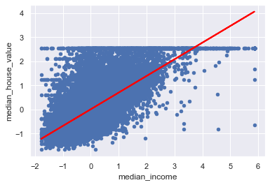


### Hypothesis testing and P values: 
using the null hypothesis lets assume there is no relationship between median_income and median_house_value
<br>Lets test this hypothesis. We shall reject the Null Hypothesis if 95% confidence inderval does not include 0


```python
lm=smf.ols(formula='median_house_value ~ median_income',data=scaled_df).fit()
```


```python
lm.summary()
```


<table class="simpletable">
<caption>OLS Regression Results</caption>
<tr>
  <th>Dep. Variable:</th>    <td>median_house_value</td> <th>  R-squared:         </th> <td>   0.473</td> 
</tr>
<tr>
  <th>Model:</th>                    <td>OLS</td>        <th>  Adj. R-squared:    </th> <td>   0.473</td> 
</tr>
<tr>
  <th>Method:</th>              <td>Least Squares</td>   <th>  F-statistic:       </th> <td>1.856e+04</td>
</tr>
<tr>
  <th>Date:</th>              <td>Thu, 10 Oct 2019</td>  <th>  Prob (F-statistic):</th>  <td>  0.00</td>  
</tr>
<tr>
  <th>Time:</th>                  <td>16:10:17</td>      <th>  Log-Likelihood:    </th> <td> -22668.</td> 
</tr>
<tr>
  <th>No. Observations:</th>       <td> 20640</td>       <th>  AIC:               </th> <td>4.534e+04</td>
</tr>
<tr>
  <th>Df Residuals:</th>           <td> 20638</td>       <th>  BIC:               </th> <td>4.536e+04</td>
</tr>
<tr>
  <th>Df Model:</th>               <td>     1</td>       <th>                     </th>     <td> </td>    
</tr>
<tr>
  <th>Covariance Type:</th>       <td>nonrobust</td>     <th>                     </th>     <td> </td>    
</tr>
</table>
<table class="simpletable">
<tr>
        <td></td>           <th>coef</th>     <th>std err</th>      <th>t</th>      <th>P>|t|</th>  <th>[0.025</th>    <th>0.975]</th>  
</tr>
<tr>
  <th>Intercept</th>     <td>-4.857e-17</td> <td>    0.005</td> <td>-9.62e-15</td> <td> 1.000</td> <td>   -0.010</td> <td>    0.010</td>
</tr>
<tr>
  <th>median_income</th> <td>    0.6881</td> <td>    0.005</td> <td>  136.223</td> <td> 0.000</td> <td>    0.678</td> <td>    0.698</td>
</tr>
</table>
<table class="simpletable">
<tr>
  <th>Omnibus:</th>       <td>4245.795</td> <th>  Durbin-Watson:     </th> <td>   0.655</td>
</tr>
<tr>
  <th>Prob(Omnibus):</th>  <td> 0.000</td>  <th>  Jarque-Bera (JB):  </th> <td>9273.446</td>
</tr>
<tr>
  <th>Skew:</th>           <td> 1.191</td>  <th>  Prob(JB):          </th> <td>    0.00</td>
</tr>
<tr>
  <th>Kurtosis:</th>       <td> 5.260</td>  <th>  Cond. No.          </th> <td>    1.00</td>
</tr>
</table><br/><br/>Warnings:<br/>[1] Standard Errors assume that the covariance matrix of the errors is correctly specified.


## Insight:
    The P value is 0.000 indicates strong evidence against the null hypothesis, so you reject the null hypothesis.
     so, there is a strong relationship between median_house_value and median_income


```python

```
